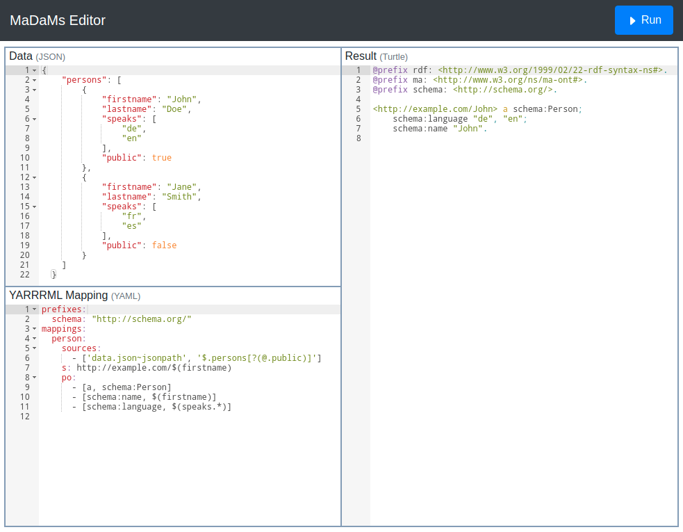

# MaDaMs Editor (**Ma**terial **Da**ta **M**apping)

(yet simple) Text based editor to map JSON data with [YARRRML](http://rml.io/yarrrml/) (a human-readible form of RDF Mapping Language [[RML](https://rml.io/specs/rml/)]) to RDF. Demo available [here](https://aksw.github.io/MadamsEditor/dist/).

The RML to YARRRML is based on [YARRRML-Parser](https://github.com/RMLio/yarrrml-parser).

To apply the mappings on the data an RML Mapper service is **required**. We use the Node JavaScript library [RocketRML](https://github.com/semantifyit/RocketRML) for this.

## Screenshot

[](https://aksw.github.io/MadamsEditor/dist/)

## Init, install packages

    docker-compose up install

## Start development environment

Run installation first, then:

    docker-compose up dev

Access app at `http://localhost:1234` and RML mapping server at `http://localhost:3000`

To change default ports edit file `.env`

## Create productive build

Run installation first, then

    docker-compose up build

Will create files in `./dist/`

## Start productive

The productive requires one server to deliver the HTML/Javascript app and a Node server for the RML mapper.

1) Create build
2) App: make content of `./dist/` public available
3) Server: start mapping server with Docker `docker-compose up server` or directly with Node `node src/server.js`. To change default port (3000) edit file `.env`.

### Usage

See `./src/app.html` for usage example.

Usage as library:

```js
new MadamsEditor({
    // JSON DATA: url to a json ressource or JSON object as value
    'data': {
        'type': 'url' ,  // url|json
        'value': './dist/example-data.json',  // string|json
        'name': '' // string (required for json)
    },
    // MAPPING: url to yaml (yarrrml) ressource, or yaml (yarrrml) as string
    'mapping': {
        'type': 'url' , // url|yaml
        'value': './dist/example-mapping.yml', // string
        'name': '' // string (required for yaml)
    },
    // url to RML mapper service
    'rmlMapperUrl': 'http://localhost:3000/rmlmapper',
    // callback method after run
    run: function(mapping, result) { }
});
```

# Ressources

- [RML](https://rml.io/specs/rml/)
- [YARRRML](https://rml.io/yarrrml/spec/)
- [JSONPath](https://goessner.net/articles/JsonPath/index.html), [more JSONPath](https://gregsdennis.github.io/Manatee.Json/usage/path.html), [JSONPath-Plus](https://github.com/JSONPath-Plus/JSONPath)
- [YARRRML-Parser](https://github.com/RMLio/yarrrml-parser)
- [RocketRML](https://github.com/semantifyit/RocketRML)